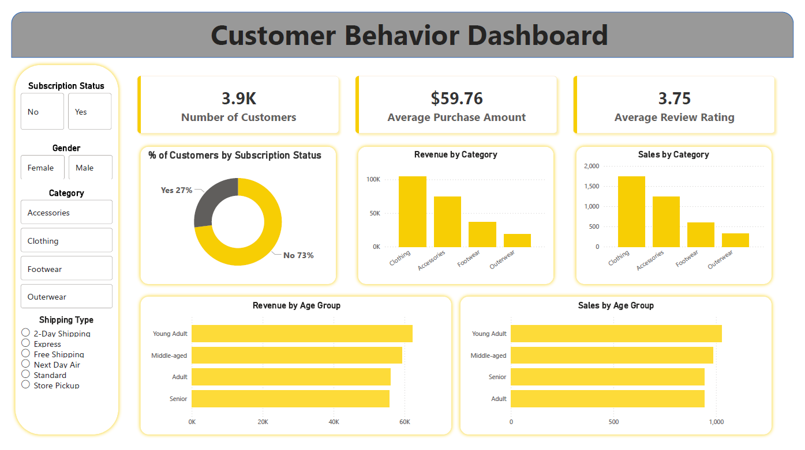

# 📊 Customer Behavior Analysis Project

## 🔍 Overview

This project analyzes customer shopping behavior to uncover patterns in purchasing habits, customer segmentation, and revenue drivers.

It follows an end-to-end data analytics workflow, starting from raw data processing in Python, continuing with SQL-based analysis in PostgreSQL, and ending with an interactive Power BI dashboard for business insights.

---

## 📁 Dataset

The dataset contains **3,900 customer records** with information about:

* Demographics: age, gender, location
* Purchasing behavior: items, categories, purchase amount
* Customer activity: previous purchases, frequency of purchases
* Marketing & engagement: discounts, subscription status
* Experience: review ratings, shipping type

---

## 🛠️ Tools & Technologies

* **Python (Pandas, NumPy)** → Data loading, cleaning, feature engineering
* **PostgreSQL** → Data analysis using SQL queries
* **SQLAlchemy & psycopg2** → Database connection
* **Power BI** → Data visualization and dashboard creation

---

## ⚙️ Project Steps

### 1. Data Loading & Initial Exploration

* Loaded CSV dataset using Pandas
* Inspected structure with `.head()`, `.info()`, `.describe()`
* Verified dataset size and data types

---

### 2. Data Cleaning & Preparation

* Checked for missing values (none found)
* Standardized column names (lowercase, snake_case)
* Renamed columns for consistency (`purchase_amount`)
* Removed redundant column (`promo_code_used`)
* Ensured data consistency across categorical fields

---

### 3. Feature Engineering

Created new features to improve analysis:

* **Age groups** (Young Adult, Adult, Middle-aged, Senior) using quartiles
* **Purchase frequency (days)** mapped from categorical values
* Cleaned and structured dataset for SQL usage

---

### 4. Data Storage (PostgreSQL)

* Connected to PostgreSQL using SQLAlchemy
* Loaded cleaned dataset into a table: `customers`
* Enabled efficient querying and analysis

---

### 5. SQL Analysis

Key business questions answered using SQL:

* Revenue comparison by gender
* Impact of discounts on spending behavior
* Top-rated and most purchased products
* Spending differences by shipping type
* Subscriber vs non-subscriber behavior
* Customer segmentation (New, Returning, Loyal)
* Repeat purchase behavior vs subscription
* Revenue contribution by age group

---

## 📊 Dashboard

The Power BI dashboard provides:

* Revenue breakdowns by customer segments
* Product and category performance
* Customer demographics insights
* Purchase behavior trends
* Interactive filters (age group, category, subscription, etc.)



---

## 📈 Results & Insights

* Identified key revenue drivers across customer segments
* Found behavioral differences between subscribed and non-subscribed users
* Highlighted top-performing products and categories
* Enabled segmentation of customers based on purchase history
* Provided actionable insights for marketing and sales strategies

---

## ▶️ How to Run

### 1. Clone Repository

```bash
git clone <repository-link>
cd <project-folder>
```

### 2. Install Dependencies

```bash
pip install pandas numpy sqlalchemy psycopg2-binary
```

### 3. Run Python Script / Notebook

* Load dataset
* Perform cleaning and feature engineering
* Export data to PostgreSQL

### 4. Set Up PostgreSQL

* Create database: `customer_behavior`
* Update credentials in script:

```python
username = "postgres"
password = "your_password"
host = "localhost"
port = "5432"
database = "customer_behavior"
```

* Run script to populate `customers` table

### 5. Run SQL Queries

* Use provided queries to generate insights

### 6. Open Power BI

* Connect to PostgreSQL or import dataset
* Open `.pbix` file to view dashboard

---

## 📌 Key Takeaways

This project demonstrates:

* End-to-end data analytics workflow
* Strong SQL querying and data manipulation skills
* Data cleaning and feature engineering in Python
* Ability to translate data into business insights through dashboards

---
